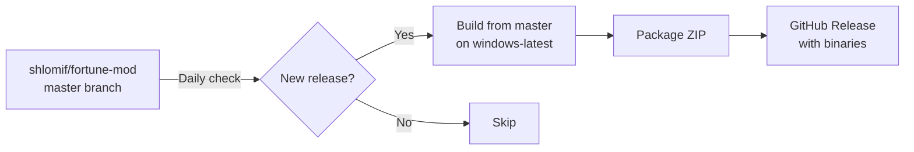

# fortune-mod-windows-builder

Automated Windows binary builds of [fortune-mod](https://github.com/shlomif/fortune-mod).

## Why?

fortune-mod releases only include source tarballs. Arch Linux, macOS (Homebrew), and most Linux distros already package it — but Windows has no pre-built binaries. This repo fills that gap.

## How It Works



1. **Daily cron** checks `shlomif/fortune-mod` for new releases
2. If a new tag is found (pattern: `fortune-mod-X.Y.Z`), triggers the build
3. Builds from **master branch** using MSYS2/MinGW64 on GitHub Actions (includes Windows path fixes not yet in any release)
4. Packages `fortune.exe`, `strfile.exe`, `unstr.exe`, `rot.exe` + all fortune data files + required DLLs
5. Publishes a GitHub Release with the ZIP

## Manual Trigger

Go to **Actions → Build Windows Binaries → Run workflow** and optionally specify a version.

## Installation

### Scoop (recommended)

```powershell
scoop bucket add latipun7 https://github.com/latipun7/scoop-bucket
scoop install latipun7/fortune-mod
```

Then just run `fortune` from anywhere:

```powershell
fortune          # random quote
fortune -s       # short only
fortune -l       # long only
fortune -a       # all databases (including offensive)
fortune -o       # offensive only
```

### Manual

Download the ZIP from [Releases](https://github.com/latipun7/fortune-mod-windows-builder/releases), extract, then use `.\fortune.cmd` or add `bin\` to PATH.

## What's Included

| File | Description |
|------|-------------|
| `bin/fortune.exe` | Main fortune command |
| `bin/strfile.exe` | Create .dat index files for fortune databases |
| `bin/unstr.exe` | Reverse strfile |
| `bin/rot.exe` | Rot13 filter |
| `bin/*.dll` | MinGW runtime DLLs (libsystre, libtre, libiconv, libintl) |
| `share/games/fortunes/*` | All fortune cookie databases |
| `fortune.cmd` | Quick launcher (cd to package root + run fortune) |

## Upstream

All credit goes to [Shlomi Fish](https://www.shlomifish.org/) and contributors. This repo builds from the upstream master branch with a relative `COOKIEDIR` so fortune finds its data files on any machine.

## License

Same as upstream: BSD-like license. See [LICENSE](https://github.com/shlomif/fortune-mod/blob/master/LICENSE).
