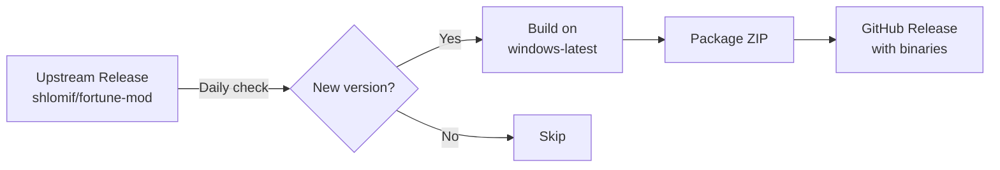

# fortune-mod-windows-builder

Automated Windows binary builds of [fortune-mod](https://github.com/shlomif/fortune-mod).

## Why?

fortune-mod releases only include source tarballs. Arch Linux, macOS (Homebrew), and most Linux distros already package it — but Windows has no pre-built binaries. This repo fills that gap.

## How It Works



1. **Daily cron** checks `shlomif/fortune-mod` for new releases
2. If a new tag is found (pattern: `fortune-mod-X.Y.Z`), triggers the build
3. Builds using MSYS2/MinGW64 toolchain on GitHub Actions
4. Packages `fortune.exe`, `strfile.exe`, `unstr.exe`, `rot.exe` + all fortune data files
5. Publishes a GitHub Release with the ZIP

## Manual Trigger

Go to **Actions → Build Windows Binaries → Run workflow** and optionally specify a version.

## What's Included

| File | Description |
|------|-------------|
| `bin/fortune.exe` | Main fortune command |
| `bin/strfile.exe` | Create .dat index files for fortune databases |
| `bin/unstr.exe` | Reverse strfile |
| `bin/rot.exe` | Rot13 filter |
| `share/games/fortunes/*` | All fortune cookie databases |
| `fortune.cmd` | Quick launcher |

## Usage

```powershell
# Download from Releases, extract, then:
.\bin\fortune.exe
.\bin\fortune.exe -a      # all databases
.\bin\fortune.exe -o      # offensive fortunes
.\bin\fortune.exe -s      # short only
.\bin\fortune.exe -l      # long only
```

## Adding to PATH

```powershell
# Add to current session
$env:PATH += ";C:\path\to\fortune-mod-windows-x64\bin"

# Add permanently (user-level)
[Environment]::SetEnvironmentVariable("PATH", $env:PATH + ";C:\path\to\fortune-mod-windows-x64\bin", "User")
```

## Upstream

All credit goes to [Shlomi Fish](https://www.shlomifish.org/) and contributors. This repo only builds — it does not modify the source.

## License

Same as upstream: BSD-like license. See [LICENSE](https://github.com/shlomif/fortune-mod/blob/master/LICENSE).
